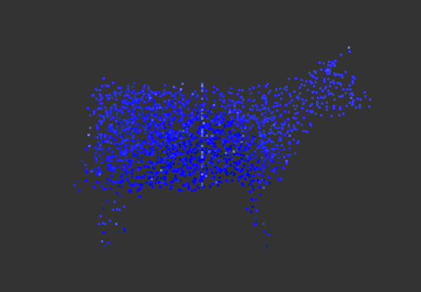
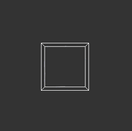
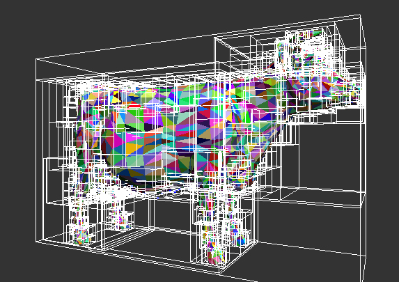
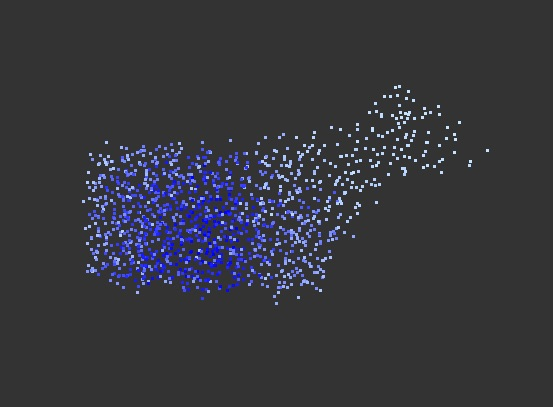

#  CIS700-Simulation

## Implement Fast Poisson Disk Sampling

<p align="center"></p>

### The Poisson Algorithm:

```
Select an initial location to create the first sample s.t. it is within the given bounds. 
Add this to the grid and list of active samples
while the number of active samples > 0
	Pick a random sample x_i from the list of active samples
	Randomly sample K more locations within the R to 2R distance around x_i's location
	for each of these K random samples
		if the sample is not less than R distance away to any other sample on the grid:
			it is not a valid sample
		otherwise it is a valid sample:
			add it to the active samples list and to the background grid
	if no samples were added from the K samples chosen for this x_i sample:
		x_i is now a permanent sample so it is removed from the active sample listing
The final created background grid contains all valid samples as defined by the R to 2R restrictions
```

### My Implementation:

- My implementation is almost exactly like the above algorithm except it includes a mesh check to make sure that once a sample is guaranteed to be valid for the grid, it is also guaranteed to be a valid location inside the original mesh object.
- BVH structure to speed up mesh checking for if a sample lies properly within the object.

- 2D/3D background grid used for allocation and speeding up search for nearby samples within the Radius and 2*Radius restriction.

### BVH:

First we set up our bounding box for a simple mesh, in this case a cube. The bounding box becomes fundamental when doing mesh intersection checking for if a new sample is valid in the object it is to be filling. Then, we use a the surface area heuristic on our bvh's treenode structure to know when to stop splitting the list of triangles into more children.

<p align="center">

</p>

### Mesh Check:

There are two different ways to do the mesh check:
-  (1) During Sample Creation: Once a sample is checked as valid in the grid, you check if it is valid in the object before testing any other new valid samples
-  (2) At the End: Fill in the entire outer bounding box of the mesh using the sampler and just remove every sampled location that is not valid within the object.

In terms of runtime, implementation (1) and (2) both end up checking the same number of samples against the given object; however (2) is the better implementation overall since there is fewer restrictions as to how the points spread. In the following two photos, the bluer the point the older it is and the whiter the point, the newer it is. As the first image for implementation (1) demonstrates, the sampling iterates out from the center yet it becomes less and less likely for new samples to be created in oddly shaped sections like the legs and head, just because there are fewer previously existing samples around them, since in this implementation we are culling samples as they are being created. In contrast, the second image for implementation (2) demonstrates that the lack of restrictions in creating the sample in the first place by only culling all samples at the end is much more effective as it allows existing samples around the harder to reach places making it just as likely for a sample to exist in the head compared to the legs of the cow.

<p align="center">
 
</p>

### Uses:

- For anything that needs an end result that is an even but random distribution of samples. 
- My use: Setting up the initial state of particles for a simulation.
- Could also be used in rendering but due to computational time for a large sample space, it is avoided in real-time rendering. 

### Overview of Research:

I am using the Bridson's paper on [Poisson Disk Sampling Method for Arbitrary Dimensions](./Part1Info/PoissonDiskPaper.pdf) to make a point cloud representation of a given mesh in both two and three dimensions. Previous sampling techniques include Cook's 1986 paper that discusses an implementation for Stochastic Sampling [a Monte Carlo technique] and Dunbar and Humphrey’s paper in 2006 that describes a dated implementation for the sampling technique.


Cook’s paper describes a technique used to take the place of Poisson Disk Sampling due memory costs of the randomness of a look-up table for the original sampling technique. The Stochastic Sampling technique aimed to improve upon the issues of aliasing by allowing for noise instead; however, the paper focused on using the jitter of a regular grid to implement the sampling. Like actual Poisson Disk Sampling, jittering is well suited for image-rendering algorithms and removes some aliasing; however the results are not quite as good as those actually obtained with the original sampling technique. Additionally, the images still maintain a bit of aliasing and noise due to only a reduction but not complete elimination of sample clustering.


Dunbar and Humphrey's paper describes an improved implementation of Poisson sampling. By using an efficient data structure they are able to perform uniform sampling within the r and 2r radii around each sampled location, and by maintaining that each valid sample must contain at least one other sample within the range of those two radii, their algorithm works as intended. However, this technique does not easily generalize for uses in rendering with additional effects such as motion blur and depth of field in higher dimensions [aka in 3D rendering], therefore, Bridson's algorithm is the preferred implementation for this project.


As Bridson's previously linked paper delineates, his algorithm easily extends to n-dimensions while still running in O(N) time to generate the requested N Poisson Disk Samples [aka running proportional to the number of requested samples]. Additionally, in contrast with Dunbar and Humphrey's approach, once the samples are picked from the appropriate region, Bridson's algorithm uses rejection sampling [when an existing valid sample no longer has any other new/valid samples within its valid sample range it is no longer a valid sample] instead of using the clear-cut restrictions to compute the allowed sampling region. This is beneficial as it allows the sampling to develop more organically thus reducing the chaotic-ness of the random selection, speeding up the process as a whole.
